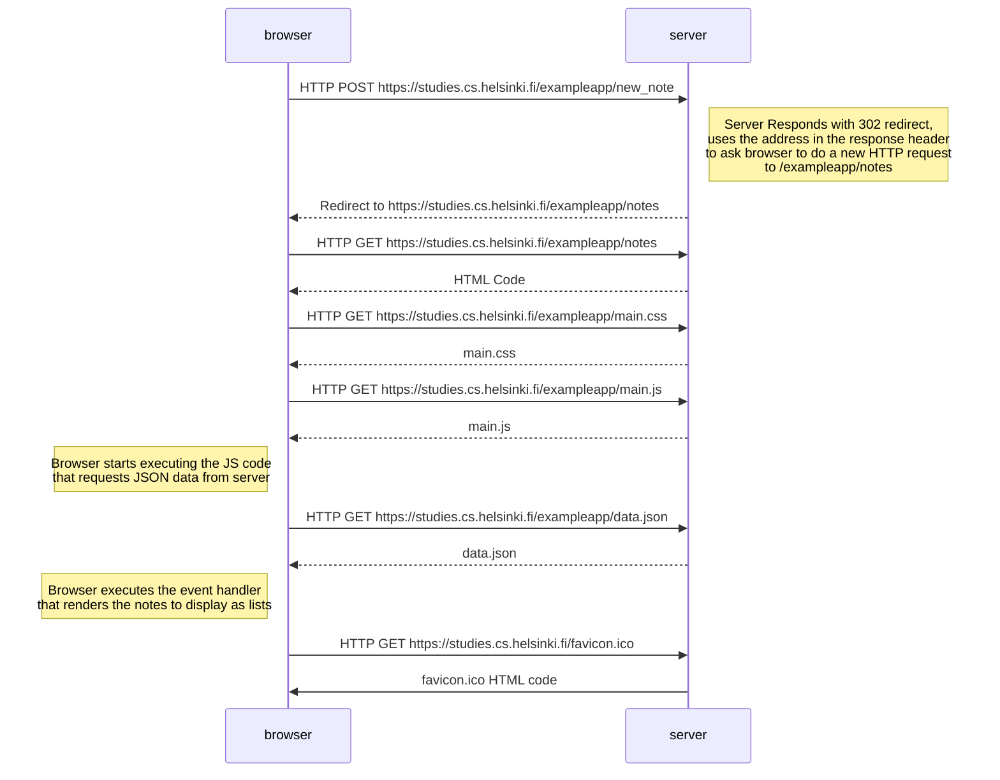

# Chain of events on submitting the form

This is the chain of events that follows on typing data into the input field and then clicking the submit button.

```mermaid
sequenceDiagram
participant browser
participant server
browser->>server: HTTP POST https://studies.cs.helsinki.fi/exampleapp/new_note
Note right of server: Server Responds with 302 redirect, <br/>uses the address in the response header <br/> to ask browser to do a new HTTP request <br/> to /exampleapp/notes
server-->>browser: Redirect to https://studies.cs.helsinki.fi/exampleapp/notes
browser->>server: HTTP GET https://studies.cs.helsinki.fi/exampleapp/notes
server-->>browser: HTML Code
browser->>server: HTTP GET https://studies.cs.helsinki.fi/exampleapp/main.css
server-->>browser: main.css
browser->>server: HTTP GET https://studies.cs.helsinki.fi/exampleapp/main.js
server-->>browser: main.js
Note left of browser: Browser starts executing the JS code <br/>that requests JSON data from server
browser->>server: HTTP GET https://studies.cs.helsinki.fi/exampleapp/data.json
server-->>browser: data.json
Note left of browser: Browser executes the event handler <br/>that renders the notes to display as lists
browser->>server: HTTP GET https://studies.cs.helsinki.fi/favicon.ico
server->>browser: favicon.ico HTML code
```
