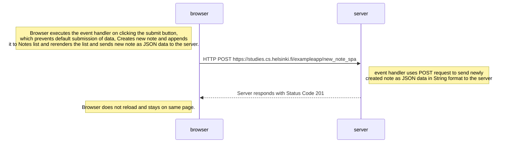

# Chain of events on submitting data to the form in the SPA

```mermaid
sequenceDiagram
participant browser
participant server
Note left of browser: Browser executes the event handler on clicking the submit button,<br/> which prevents default submission of data, Creates new note and appends<br/> it to Notes list and rerenders the list and sends new note as JSON data to the server.
browser->>server: HTTP POST https://studies.cs.helsinki.fi/exampleapp/new_note_spa
Note right of server: event handler uses POST request to send newly <br/>created note as JSON data in String format to the server
server-->>browser: Server responds with Status Code 201
Note left of browser: Browser does not reload and stays on same page.
```
